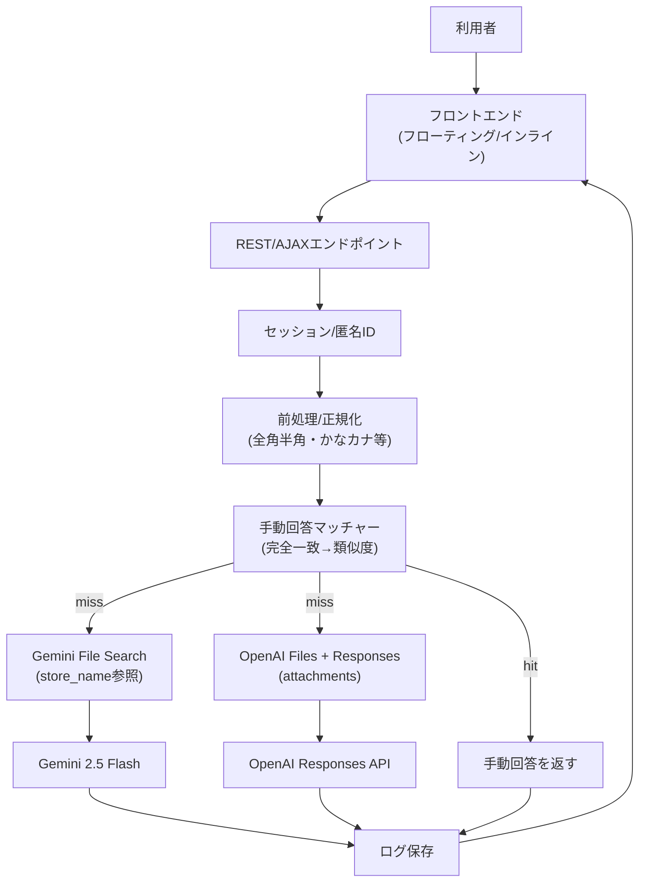
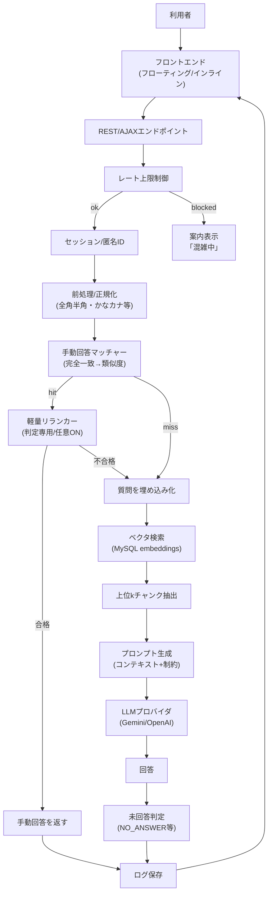

## WordPressチャットボットプラグイン 仕様書（Gemini File Search / OpenAI Responses）

本仕様書は、ショートコード設置型の資料ベースQAチャットボットプラグインの要件を示す。資料検索・回答生成は外部ストアに委譲し、**Gemini File Search** と **OpenAI Responses API（Files/attachments）** の両方に対応。アップロード時に各プロバイダへファイルを登録して利用する（ローカルベクタ検索は廃止）。

---

### 1. 合意済みの前提
- クラウドAPIは **Gemini File Search** および **OpenAI Responses API（Files）** を利用。
- 資料スコープはショートコードごとの「資料セット」単位。
- 資料にない内容は回答しない。安全文言で「分からない」と返す。
- 資料検索は外部ストア検索（Gemini File Search / OpenAI attachments）。ローカルベクタ検索は使用しない。
- 対応ファイル: PDF / テキスト(.txt/.md)（Office系は除外）。
- UI: フローティング(右下ボタン→開閉) と インライン（埋め込み）をショートコード属性で切替。ライト/ダークのテーマ色のみ最小カスタマイズ。
- アクセス: 一般公開。
- ログ: 全質問・回答を保存。未回答を自動検知しフラグ付与。管理画面から手動回答登録→同資料セットで再利用。
- レート上限超過: チャットUIを出さず案内文のみ表示。

---

### 2. データモデル（MySQL想定）

#### 2.1 資料セット・ファイル
- `knowledge_sets`
  - `id`, `slug`, `name`, `description`, `store_name`(Gemini File Searchのstore id), `default_provider_id`, `created_at`, `updated_at`.
- `knowledge_files`
  - `id`, `knowledge_set_id`, `filename`, `storage_path`, `mime_type`, `bytes`, `status`(pending|indexed|error), `remote_file_id`(Gemini File Searchのfile id), `remote_file_id_openai`(OpenAI Filesのfile id), `checksum`, `created_at`, `updated_at`.
  - ローカルチャンク/埋め込みは保持しない（外部ストアに委譲）。

#### 2.2 チャット・ログ・手動回答
- `chat_sessions`
  - `id`, `session_key`(匿名ID), `wp_user_id`(nullable), `knowledge_set_id`, `page_url`, `user_agent_hash`, `ip_hash`, `created_at`, `updated_at`.
- `chat_messages`
  - `id`, `chat_session_id`, `role`(user|assistant|system|manual), `question`, `answer`, `knowledge_set_id`, `used_manual_answer_id`(nullable), `provider`(gemini|openai), `model`, `prompt_tokens`, `completion_tokens`, `latency_ms`, `answered_from_context`(bool), `unanswered_flag`(bool), `rate_limited`(bool), `created_at`.
- `manual_answers`
  - `id`, `knowledge_set_id`, `question_pattern`, `answer_text`, `embedding_vector`(nullable; 類似度マッチ用), `enabled`(bool), `created_at`, `updated_at`.
  - マッチ条件: 正規化（全角/半角・ひらがな/カタカナ・トリム等）後に「完全一致→類似度(閾値)」を試し、ヒットしたら優先採用。必要に応じて軽量リランカー（上位数件をLLMで判定、生成は禁止）を保険としてONにできる。

#### 2.2 AI設定・レート制限
- `ai_providers`（Gemini / OpenAI に対応）
  - `id`, `type`(gemini|openai), `model`, `api_key`(暗号化保存), `temperature`, `top_p`, `max_output_tokens`, `timeout_ms`, `created_at`, `updated_at`.
- `rate_limit_state`
  - `provider_type`, `blocked_until`(timestamp), `last_error`.

---

### 3. AI回答フロー（Gemini File Search / OpenAI Responses）



#### 3.1 処理手順
1. セッション取得。
2. 手動回答マッチ（正規化→完全一致→類似度、必要に応じリランカー）。ヒットすれば返答。
3. ヒットしない場合、優先して `store_name` に紐づく Gemini File Search をツール指定し回答生成（Gemini 2.5 Flash）。
4. Geminiが使えない場合または失敗時、OpenAI Files の `remote_file_id_openai` を添付し Responses API で回答生成。
5. 未回答判定は応答内容を見て行い、ログ保存。

#### 3.2 レート制限検知
- 429等を受けたら `rate_limit_state` に `blocked_until` を記録。
- ブロック中はチャットUIを出さず案内文のみ表示。経過後に自動解除。

---

### 4. 管理画面仕様（WP管理メニュー配下）

- **資料セット管理**
  - 一覧: ID, スラッグ, 名称, 説明, 紐づくショートコード数, 登録ファイル数, 状態。
  - 追加/編集: 名称, 説明, store_name（Gemini File Searchのstore id）、アクセス制限(今回は公開想定のため簡易), 作成/更新日時。

- **ファイル管理 / アップロード**
  - 資料セットを選択、または新規作成してファイルをアップロード（対応拡張子: pdf, txt, md）。
  - アップロード時に Gemini File Search ストアを作成し、ファイルをアップロードして `remote_file_id` を保存。OpenAI Files へもアップロードし `remote_file_id_openai` を保存。いずれか成功で `indexed`。両方失敗で `error` とエラーログ。
  - 一覧: 状態（pending/indexed/error）と削除操作（リモート/ローカル/DB削除）。
  - 削除: 一覧から削除実行で、Gemini / OpenAI のリモートファイルとローカルファイルを削除し、DB行も削除。

- **チャットログ一覧**
  - 表示項目: 日時, ページURL, ユーザー（匿名ID/ログインユーザー名）, 質問, 回答サマリ, 未回答フラグ, 資料セット名, 使用モデル。
  - フィルタ: 資料セット、未回答のみ、期間。

- **未回答→手動回答登録フロー**
  - ログ行から「手動回答を登録」ボタン。
  - 入力: 質問文、回答文、対象資料セット、オン/オフ。保存時に類似度用ベクタを生成し、以降は手動回答が優先。

- **AI設定**
  - Gemini APIキー・モデル名・温度・top_p・最大出力トークン・タイムアウト。
  - テスト接続ボタン（簡易スタブ）。APIキーは wp_options に暗号化保存（環境変数/定数があれば優先）。
  - レート上限エラー検知設定（ブロック時間、案内文）。

---

### 5. ショートコードとフロントUI

- 基本形（例）
  - `[my_chatbot layout="floating" dataset="sales_faq" theme="light"]`
  - `[my_chatbot layout="inline" dataset="support_guide" theme="dark"]`

- 属性
  - `layout`: `floating` | `inline`（必須）
  - `dataset`: 資料セットスラッグ/ID（必須）
  - `theme`: `light` | `dark`（任意、デフォルトlight）
  - 将来拡張案: `class`, `initial_message`, `placeholder`, `button_label`, `aria_label` など。

- フローティングUI
  - 右下ボタン（丸/吹き出し）。クリックでモーダル風チャットを開閉。
  - モバイル: 横幅80〜90%、高さは画面高の ~70% 上限目安。

- インラインUI
  - ページ内カード風。履歴表示 + 入力エリア + 送信ボタン。
  - スクロール領域に最大高さを設け、モバイルでの縦長化を防止。

- 共通挙動
  - 送信中はローディングインジケータ。
  - ネットワーク/LLMエラー時はエラーメッセージ表示。
  - セッション保持: 簡易にクッキー/ローカルストレージで匿名IDを再利用。
  - **レート上限時**: UIを描画せず案内文（例: 「現在混雑のためチャットボットをご利用いただけません」）のみ表示。

---

### 6. 削除・アンインストール時の挙動
- 管理画面の削除操作: Gemini / OpenAI のリモートファイル、ローカルファイルを削除し、DB行も削除。
- プラグインアンインストール時: 全ファイルを走査し、Gemini / OpenAI 両方のリモートファイルを削除。ローカルファイル削除、テーブルDROP、オプション削除、Cron解除。

---

### 7. 非機能要件

- セキュリティ
  - アップロード拡張子ホワイトリスト＋サイズ上限。ウイルススキャンは将来検討。
  - AI送信データはテキスト化した資料内容＋質問のみ。機密想定時は注意書きを管理画面に表示。
  - 管理系APIは `manage_options` 権限、チャット送信用は公開だがCSRFトークン/nonceで保護。

- パフォーマンス
  - 中規模（数百ファイル、合計数GB）を想定。チャンク分割＋埋め込み生成を非同期化。
  - MySQLベクタ検索は次元数・上位kを絞り、インデックス最適化（必要に応じ簡易近似手法）。
  - コンテキスト長を上限管理し、タイムアウト設定を持つ。

- 既知の制限
  - 画像OCRは非対応（v1対象外）。
  - 手動回答マッチは完全一致＋簡易類似度から開始。
  - ベクタDB外部サービス未使用（MySQLのみ）。将来の差し替えは要改修。

- ファイル制約とエラー表示
  - 拡張子: pdf, txt, md のみ許可（Office系は除外）。
  - 単一ファイル上限: 50MB（初期値、管理画面で調整可能にしてもよい）。
  - 合計アップロード上限（資料セット単位想定）: 3GB。超過時はアップロードを拒否し、「合計容量が上限（3GB）を超えています」と表示。
  - 拒否時は詳細な理由（サイズ/拡張子）をユーザーに返す。

---

### 8. 実装詳細ポリシー

- APIキー管理
  - 優先順: 定数/環境変数 (`WP_GEMINI_API_KEY`, `WP_OPENAI_API_KEY`) → wp_options に暗号化保存（OpenSSL + AUTH_KEY/SALT）。保存時にマスキング表示。
  - テスト接続ボタンで、指定モデル・キーで短いpingリクエストを実行し結果を表示。

- DBマイグレーションとインデックス方針
  - knowledge_sets/files/chunks/embeddings、chat_sessions/messages、manual_answers、ai_providers、rate_limit_state を作成。
  - 主なインデックス例:
    - `knowledge_embeddings`: (knowledge_set_id), (knowledge_set_id, dimension)
    - `knowledge_chunks`: (knowledge_set_id, chunk_index)
    - `knowledge_files`: (knowledge_set_id, status)
    - `chat_sessions`: (knowledge_set_id), (created_at)
    - `chat_messages`: (chat_session_id), (knowledge_set_id, created_at), (unanswered_flag)
    - `manual_answers`: (knowledge_set_id, enabled)
  - プレフィックスは `$wpdb->prefix` を必ず利用。

- バックグラウンド処理
  - 実装しやすさ優先で WP-Cron を採用。アップロード完了後にジョブを enqueue → チャンク生成 → 埋め込み生成をバッチ実行。再入可能・分割実行（大きいファイルは複数ジョブに分割）。
  - ジョブの冪等性（途中エラー時は再試行）と進捗ステータスを knowledge_files / knowledge_chunks に保持。

- レート上限制御
  - 429 等を検知したら `blocked_until` に現在時刻 + 10分（初期値、設定で変更可）をセット。
  - ブロック期間中はチャットを描画せず、案内文を表示: 「現在、アクセスが集中しているためご利用いただけない状況となっております。」

- 正規化と閾値（初期値）
  - 正規化: 全角/半角変換、ひらがな/カタカナ統一、前後空白トリム、連続空白の単一化、記号の一部除去。
  - 手動回答類似度閾値: 0.8 から開始し管理画面で調整可能にする。
  - リランカー: デフォルト OFF、管理画面で ON/OFF。ON時は上位3件程度を判定専用LLMでYES/NO評価、YESのみ返答。

- テスト計画（観点例）
  - 管理画面: 資料セットCRUD、ファイルアップロード/再インデックス、AI設定保存・テスト接続、レート上限設定。
  - フロント: ショートコード表示（floating/inline）、テーマ切替、送信/ローディング/エラー表示。
  - 未回答→手動回答: 未回答フラグ確認、手動回答登録後の再質問でヒットすること（正規化・類似度・リランカーON/OFF）。
  - レート上限: blocked_until中にチャット非表示＋案内文表示になること。
  - 正規化＆類似度: 全角/半角・かな/カナの言い換えで手動回答がマッチすること。

---

## 付録A: 詳細アーキテクチャ図



---

## 付録B: ER風データ定義（抜粋・MySQL想定）

### knowledge_sets
| column | type | note |
| --- | --- | --- |
| id (PK) | BIGINT |  |
| slug | VARCHAR(190) | unique |
| name | VARCHAR(190) |  |
| description | TEXT |  |
| store_name | VARCHAR(190) | Gemini File Search store id |
| default_provider_id | BIGINT | fk ai_providers |
| created_at/updated_at | DATETIME |  |

### knowledge_files
| column | type | note |
| --- | --- | --- |
| id (PK) | BIGINT |  |
| knowledge_set_id | BIGINT | fk |
| filename | VARCHAR(255) |  |
| storage_path | VARCHAR(500) |  |
| mime_type | VARCHAR(100) |  |
| bytes | BIGINT |  |
| status | ENUM('pending','indexed','error') |  |
| remote_file_id | VARCHAR(190) | Gemini File Search file id |
| checksum | CHAR(64) | sha256等 |
| created_at/updated_at | DATETIME |  |

### chat_sessions
| column | type | note |
| --- | --- | --- |
| id (PK) | BIGINT |  |
| session_key | CHAR(36) | anon uuid |
| wp_user_id | BIGINT NULL | nullable |
| knowledge_set_id | BIGINT | fk |
| page_url | TEXT |  |
| user_agent_hash | CHAR(64) |  |
| ip_hash | CHAR(64) |  |
| created_at/updated_at | DATETIME |  |

### chat_messages
| column | type | note |
| --- | --- | --- |
| id (PK) | BIGINT |  |
| chat_session_id | BIGINT | fk |
| role | ENUM('user','assistant','system','manual') |  |
| question | MEDIUMTEXT |  |
| answer | MEDIUMTEXT |  |
| knowledge_set_id | BIGINT | fk |
| used_manual_answer_id | BIGINT NULL | fk |
| provider | ENUM('gemini','openai') |  |
| model | VARCHAR(190) |  |
| prompt_tokens/completion_tokens | INT |  |
| latency_ms | INT |  |
| answered_from_context | TINYINT(1) |  |
| unanswered_flag | TINYINT(1) |  |
| rate_limited | TINYINT(1) |  |
| created_at | DATETIME |  |

### manual_answers
| column | type | note |
| --- | --- | --- |
| id (PK) | BIGINT |  |
| knowledge_set_id | BIGINT | fk |
| question_pattern | TEXT |  |
| answer_text | MEDIUMTEXT |  |
| embedding_vector | BLOB NULL | 類似度用 |
| enabled | TINYINT(1) |  |
| created_at/updated_at | DATETIME |  |

### ai_providers
| column | type | note |
| --- | --- | --- |
| id (PK) | BIGINT |  |
| type | ENUM('gemini','openai') |  |
| model | VARCHAR(190) |  |
| api_key | TEXT | 暗号化保存 |
| temperature | DECIMAL(3,2) |  |
| top_p | DECIMAL(3,2) |  |
| max_output_tokens | INT |  |
| timeout_ms | INT |  |
| created_at/updated_at | DATETIME |  |

### rate_limit_state（テーブルまたは wp_options）
| column | type | note |
| --- | --- | --- |
| provider_type | ENUM('gemini','openai') |  |
| blocked_until | DATETIME |  |
| last_error | TEXT |  |

---

### OpenAI対応メモ
- アップロード時に OpenAI Files API にも送信し、`remote_file_id_openai` を保持。
- 回答時に Gemini 失敗または未設定の場合は、OpenAI Responses API に `attachments` として `remote_file_id_openai` を付与し、file_search ツールを利用。

---

## 付録C: ショートコード仕様リファレンス

| 属性 | 必須 | 値 | 役割 |
| --- | --- | --- | --- |
| layout | yes | floating / inline | レイアウト種別 |
| dataset | yes | 資料セットslug/ID | 資料束指定 |
| theme | no | light / dark | テーマ色 |
| class | no | 任意文字列 | ラッパーに付与 |
| initial_message | no | テキスト | 初期表示文 |
| placeholder | no | テキスト | 入力欄プレースホルダ |
| button_label | no | テキスト | 送信ボタン文言 |

サンプル:
- `[my_chatbot layout="floating" dataset="sales_faq" theme="light"]`
- `[my_chatbot layout="inline" dataset="support_guide" theme="dark" initial_message="ご質問をどうぞ"]`

レート上限検知時: ショートコードはチャットUIを描画せず、案内文のみ表示。

---

## 付録D: プロンプト雛形と未回答判定

- システムメッセージ例（LLMに渡す）
  ```
  あなたは資料ベースの回答エンジンです。与えられたコンテキストの範囲内だけで回答してください。
  コンテキストに無い内容は推測せず、次の定型で答えてください:「資料に記載がないためお答えできません」。
  ```
- ユーザーメッセージ: 質問テキスト。
- コンテキスト: 上位kチャンクを箇条書きで渡す。
- 未回答判定:
  - LLM出力が「資料に記載がないためお答えできません」または特殊トークン `NO_ANSWER` を含む場合 → `unanswered_flag=true`。
  - 類似度閾値が低い場合（上位スコアがしきい値未満）も未回答扱いにできるオプション。
- 手動回答リランカー用の判定プロンプト例（判定のみ、生成禁止）
  ```
  あなたは意味類似度の判定だけを行うアシスタントです。新しい回答は生成せず、与えられた「質問」と「候補回答」が意味的に整合するかを yes/no で判定してください。
  質問: {{question}}
  候補回答: {{manual_answer}}
  出力は "YES" または "NO" のみ。
  ```

---

## 付録E: 管理画面ワイヤー要点
- 資料セット一覧: 追加/編集への導線、紐づくショートコード数、ファイル数。
- ファイル管理: アップロード（複数可）、拡張子/サイズチェック、インデックス進捗表示、削除・再インデックス。
- チャットログ: 質問・回答・日時・ページ・未回答フラグ・資料セット・モデル。フィルタ（資料セット、未回答、期間）。
- 未回答→手動回答: ログ行から登録モーダル、保存時に手動回答も埋め込み生成。
- AI設定: プロバイダ種別/モデル/APIキー/温度/top_p/最大トークン/タイムアウト。接続テスト。レート上限ブロック時間・案内文設定。
